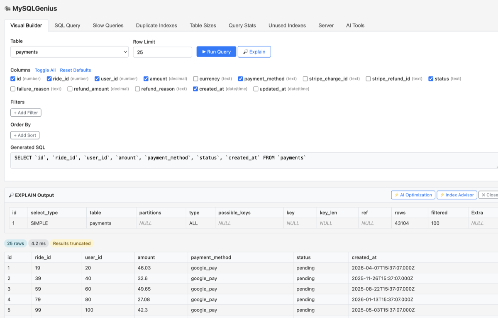
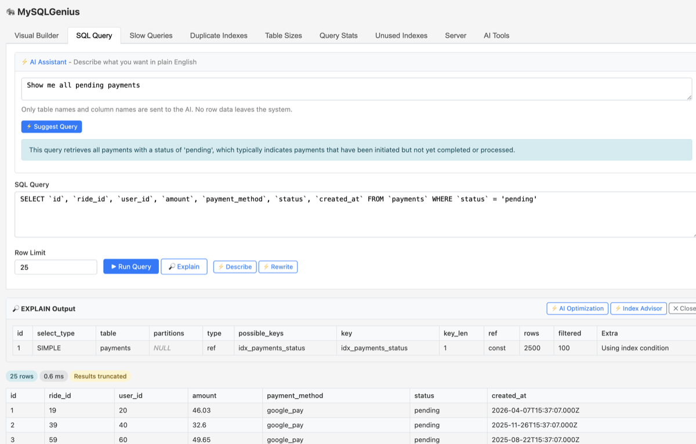
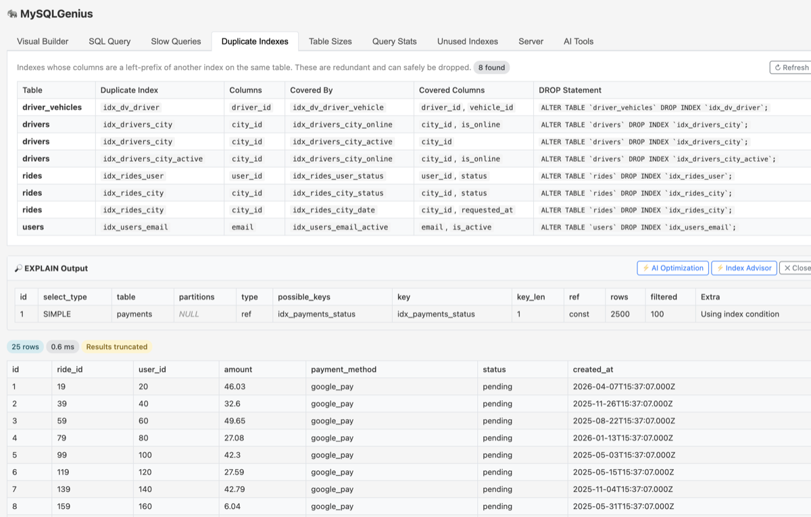
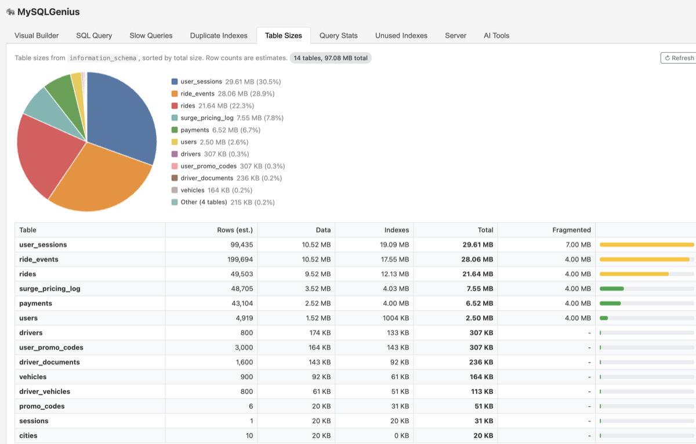
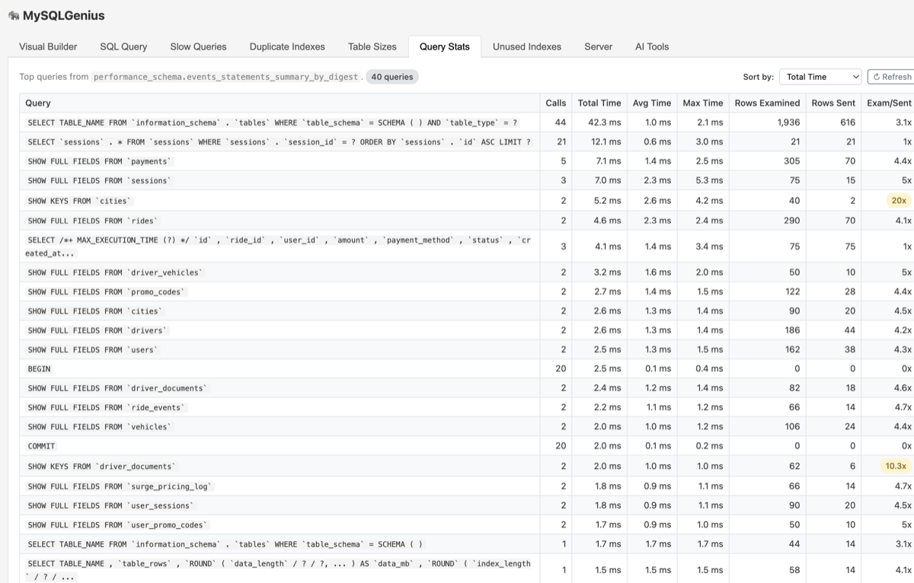
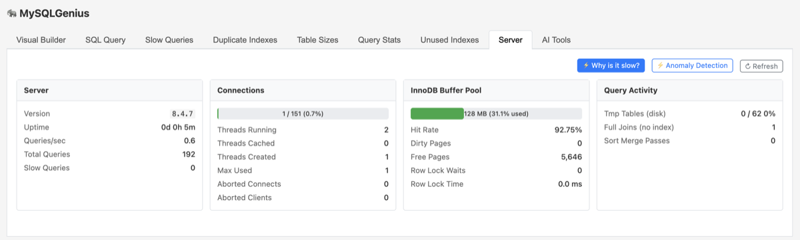
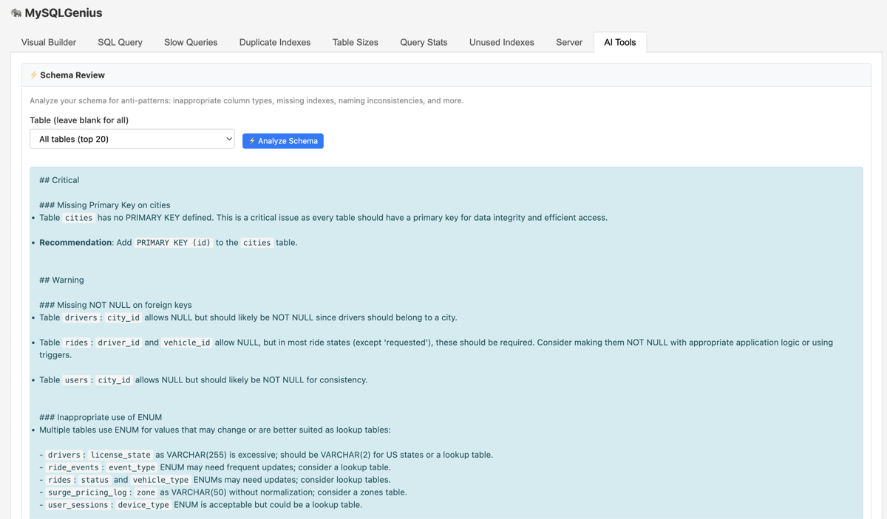

# MySQLGenius

A MySQL performance dashboard and query explorer for Rails, inspired by [PgHero](https://github.com/ankane/pghero). If you've used PgHero for PostgreSQL and wished something similar existed for MySQL -- this is it, with AI-powered query suggestions and optimization on top.

## Screenshots

### Visual Builder
Build queries visually -- select tables, pick columns, add type-aware filters, and sort results without writing SQL.



### SQL Query with AI Assistant
Write raw SQL or describe what you want in plain English and let the AI generate the query for you.



### Duplicate Index Detection
Find redundant indexes whose columns are a left-prefix of another index, with ready-to-run `DROP INDEX` statements.



### Table Sizes
View row counts, data size, index size, fragmentation, and a visual size chart for every table.



### Query Stats
Top queries from `performance_schema` sorted by total time, with call counts, avg/max time, and rows examined.



### Server Dashboard
At-a-glance server health: version, connections, InnoDB buffer pool, and query activity with AI-powered diagnostics.



### AI Tools
Schema review that finds anti-patterns -- missing primary keys, nullable foreign keys, inappropriate column types, and more.



## Features

- **Visual Query Builder** -- point-and-click query construction with column selection, type-aware filters, and ordering
- **Safe SQL Execution** -- read-only enforcement, blocked tables, masked sensitive columns, row limits, query timeouts
- **EXPLAIN Analysis** -- run EXPLAIN on any query and view the execution plan
- **AI Query Suggestions** -- describe what you want in plain English, get SQL back (optional, any OpenAI-compatible API)
- **AI Query Optimization** -- get actionable optimization suggestions from EXPLAIN output (optional)
- **Slow Query Monitoring** -- captures slow SELECT queries via ActiveSupport notifications and Redis
- **Duplicate Index Detection** -- finds redundant indexes whose columns are a left-prefix of another index
- **Table Size Dashboard** -- view row counts, data size, index size, and fragmentation for all tables
- **Audit Logging** -- logs all query executions, rejections, and errors
- **MariaDB Support** -- automatically detects MariaDB and uses appropriate timeout syntax
- **Self-contained UI** -- no external CSS/JS dependencies, works with any Rails layout
- **Zero jQuery** -- pure vanilla JavaScript frontend

## Requirements

- Rails 5.2+
- Ruby 2.6+
- MySQL or MariaDB
- Redis (optional, for slow query monitoring)

## Installation

Add to your Gemfile:

```ruby
gem "mysql_genius"
```

Or from GitHub:

```ruby
gem "mysql_genius", github: "antarr/mysql_genius"
```

Then run:

```
bundle install
```

## Setup

### 1. Mount the engine

In `config/routes.rb`:

```ruby
Rails.application.routes.draw do
  mount MysqlGenius::Engine, at: "/mysql_genius"
end
```

To restrict access at the route level:

```ruby
# Using a session constraint
constraints ->(req) { req.session[:admin] } do
  mount MysqlGenius::Engine, at: "/mysql_genius"
end

# Or using Devise
authenticate :user, ->(u) { u.admin? } do
  mount MysqlGenius::Engine, at: "/mysql_genius"
end
```

### 2. Configure

Create `config/initializers/mysql_genius.rb`:

```ruby
MysqlGenius.configure do |config|
  # --- Authentication ---
  # Lambda that receives the controller instance. Return true to allow access.
  # Default: allows everyone. Use route constraints for most cases.
  config.authenticate = ->(controller) { true }

  # To use current_user or other app helpers, inherit from ApplicationController:
  # config.base_controller = "ApplicationController"
  # config.authenticate = ->(controller) { controller.current_user&.admin? }

  # --- Tables ---
  # Tables featured at the top of the visual builder dropdown (optional)
  config.featured_tables = %w[users posts comments]

  # Tables blocked from querying (defaults: sessions, schema_migrations, ar_internal_metadata)
  config.blocked_tables += %w[oauth_tokens api_keys]

  # Column patterns to redact with [REDACTED] in results (case-insensitive substring match)
  config.masked_column_patterns = %w[password secret digest token ssn]

  # Default columns checked in the visual builder per table (optional).
  # When empty for a table, all columns are checked by default.
  config.default_columns = {
    "users" => %w[id name email created_at],
    "posts" => %w[id title user_id published_at]
  }

  # --- Query Safety ---
  config.max_row_limit = 1000       # Hard cap on rows returned
  config.default_row_limit = 25     # Default when no limit specified
  config.query_timeout_ms = 30_000  # 30 second timeout (uses MariaDB or MySQL hints)

  # --- Slow Query Monitoring ---
  # Requires Redis. Set to nil to disable.
  config.redis_url = ENV["REDIS_URL"].presence || "redis://127.0.0.1:6379/0"
  config.slow_query_threshold_ms = 250

  # --- Audit Logging ---
  # Set to nil to disable. Logs query executions, rejections, and errors.
  config.audit_logger = Logger.new(Rails.root.join("log", "mysql_genius.log"))
end
```

### 3. AI Features (optional)

MySQLGenius supports AI-powered query suggestions and optimization via any OpenAI-compatible API, including OpenAI, Azure OpenAI, Ollama Cloud, and local Ollama instances.

```ruby
MysqlGenius.configure do |config|
  # --- Option A: OpenAI ---
  config.ai_endpoint = "https://api.openai.com/v1/chat/completions"
  config.ai_api_key = ENV["OPENAI_API_KEY"]
  config.ai_model = "gpt-4o"
  config.ai_auth_style = :bearer

  # --- Option B: Azure OpenAI ---
  config.ai_endpoint = ENV["AZURE_OPENAI_ENDPOINT"]  # Your deployment URL
  config.ai_api_key = ENV["AZURE_OPENAI_API_KEY"]
  config.ai_auth_style = :api_key                     # Default, uses api-key header

  # --- Option C: Ollama Cloud ---
  config.ai_endpoint = "https://api.ollama.com/v1/chat/completions"
  config.ai_api_key = ENV["OLLAMA_API_KEY"]
  config.ai_model = "gemma3:27b"
  config.ai_auth_style = :bearer

  # --- Option D: Local Ollama ---
  config.ai_endpoint = "http://localhost:11434/v1/chat/completions"
  config.ai_api_key = "ollama"  # Any non-empty string
  config.ai_model = "llama3"
  config.ai_auth_style = :bearer

  # --- Option E: Custom client ---
  # Any callable that accepts messages: and temperature: kwargs
  # and returns an OpenAI-compatible response hash.
  config.ai_client = ->(messages:, temperature:) {
    MyAiService.chat(messages, temperature: temperature)
  }

  # --- Domain Context ---
  # Helps the AI understand your schema and generate better queries.
  config.ai_system_context = <<~CONTEXT
    This is an e-commerce database.
    - `users` stores customer accounts. Primary key is `id`.
    - `orders` tracks purchases. Linked to users via `user_id`.
    - `products` contains the product catalog.
    - Soft-deleted records have `deleted_at IS NOT NULL`.
  CONTEXT
end
```

| Option | `ai_auth_style` | `ai_model` | Notes |
|--------|-----------------|------------|-------|
| OpenAI | `:bearer` | Required (e.g. `gpt-4o`) | |
| Azure OpenAI | `:api_key` (default) | Optional (uses deployment default) | |
| Ollama Cloud | `:bearer` | Required (e.g. `gemma3:27b`) | Follows redirects automatically |
| Local Ollama | `:bearer` | Required | No API key validation |
| Custom client | N/A | N/A | You handle everything |

When AI is not configured, the AI Assistant panel and optimization buttons are hidden automatically.

## Usage

Visit `/mysql_genius` in your browser. The dashboard has five tabs:

### Visual Builder
Select a table, pick columns, add type-aware filters (dates get date pickers, booleans get dropdowns), add sort orders, and run queries -- no SQL knowledge required. The generated SQL is shown and synced with the SQL tab.

### SQL Query
Write raw SQL directly. The optional AI Assistant lets you describe what you want in plain English and generates a query. AI-generated queries are synced back to the Visual Builder for further refinement.

### Slow Queries
View slow SELECT queries captured from your application in real time. Each slow query can be:
- **Explained** -- run EXPLAIN to see the execution plan (bypasses blocked table restrictions)
- **Used** -- copy to the SQL tab for editing and re-running
- **Optimized** -- get AI-powered optimization suggestions with specific index and rewrite recommendations

### Duplicate Indexes
Scans all tables for redundant indexes -- indexes whose columns are a left-prefix of another index on the same table. Shows the `ALTER TABLE ... DROP INDEX` statement for each duplicate, ready to copy and run.

### Table Sizes
Displays every table sorted by total size, with columns for estimated row count, data size, index size, total size, and fragmented space. Includes a visual size bar for quick comparison.

## Configuration Reference

| Option | Type | Default | Description |
|--------|------|---------|-------------|
| `authenticate` | Proc | `->(_) { true }` | Authorization check |
| `base_controller` | String | `"ActionController::Base"` | Parent controller class |
| `featured_tables` | Array | `[]` | Tables shown in Featured group |
| `blocked_tables` | Array | `[sessions, ...]` | Tables that cannot be queried |
| `masked_column_patterns` | Array | `[password, secret, ...]` | Column patterns to redact |
| `default_columns` | Hash | `{}` | Default checked columns per table |
| `max_row_limit` | Integer | `1000` | Maximum rows returned |
| `default_row_limit` | Integer | `25` | Default row limit |
| `query_timeout_ms` | Integer | `30000` | Query timeout in ms |
| `redis_url` | String | `nil` | Redis URL for slow query monitoring |
| `slow_query_threshold_ms` | Integer | `250` | Slow query threshold |
| `audit_logger` | Logger | `nil` | Logger for query audit trail |
| `ai_endpoint` | String | `nil` | AI API endpoint URL |
| `ai_api_key` | String | `nil` | AI API key |
| `ai_model` | String | `nil` | AI model name |
| `ai_auth_style` | Symbol | `:api_key` | `:bearer` or `:api_key` |
| `ai_client` | Proc | `nil` | Custom AI client callable |
| `ai_system_context` | String | `nil` | Domain context for AI prompts |

## Compatibility

Tested against:

| Rails | Ruby |
|-------|------|
| 5.2   | 2.6, 2.7, 3.0 |
| 6.0   | 2.6, 2.7, 3.0, 3.1 |
| 6.1   | 2.6, 2.7, 3.0, 3.1, 3.2, 3.3 |
| 7.0   | 2.7, 3.0, 3.1, 3.2, 3.3 |
| 7.1   | 2.7, 3.0, 3.1, 3.2, 3.3 |
| 7.2   | 3.1, 3.2, 3.3 |

## Development

```
git clone https://github.com/antarr/mysql_genius.git
cd mysql_genius
bin/setup
bundle exec rspec
```

To test against a specific Rails version:

```
RAILS_VERSION=6.1 bundle update && bundle exec rspec
```

## Contributing

Bug reports and pull requests are welcome on GitHub at https://github.com/antarr/mysql_genius.

## License

The gem is available as open source under the terms of the [MIT License](https://opensource.org/licenses/MIT).
